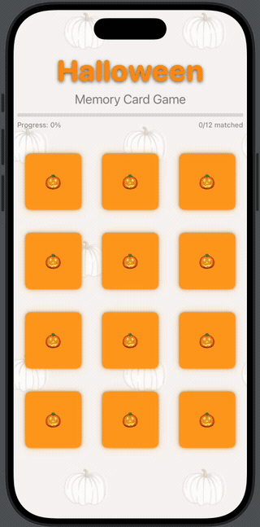

# Halloween Memory Card Game

## Assignment Details
- **Assignment**: Homework 13 - ProgressView Implementation
- **Student**: David Deng  
- **Date**: November 17 2025
- **Project**: Homework13.xcodeproj

## Features
- **Progress Tracking**: Real-time progress bar showing matching completion
- **MVVM Architecture**: Clean separation of code with Model-View-ViewModel pattern
- **Card Animation**: Playful scale animation with subtle glow effects
- **Game Logic**: Automatic match detection and game completion
- **Visual Feedback**: 
  - Progress bar updates as cards are matched
  - Matched cards show checkmark indicator with disabled state
  - Celebration overlay when game is completed
  - Orange glow hints for interactive cards
- **Halloween Theme**: Spooky-themed cards with pumpkin emoji card backs

## How to Play
1. Launch the app
2. Watch the progress bar update as you match cards
3. Tap any card to reveal the Halloween image
4. Find matching pairs by remembering card positions
5. Matched pairs will be marked with a checkmark and become inactive
6. Progress bar fills as you complete matches (50% = half the cards matched)
7. Complete all 6 pairs to win the game
8. Tap "Play Again" to restart with new random cards

## Technical Implementation

### MVVM Architecture
- **Model**: `CardModel` - Data structure for card state
- **View**: `ContentView`, `CardView` - SwiftUI views for UI presentation
- **ViewModel**: `MemoryGameViewModel` - Game rules, state management and progress tracking

### Progress View Integration
- **Reactive Progress**: Progress bar updates in real-time with game state
- **ViewModel Integration**: Proper data flow between model and view
- **Visual Feedback**: Linear progress bar with orange theme matching the game

### SwiftUI Components
- `LazyVGrid` for responsive card layout
- `ProgressView` for tracking game completion
- `@Published` properties for reactive state updates
- `@StateObject` for view model lifecycle management

## Setup Instructions
1. Open `Homework13.xcodeproj` in Xcode 15+
2. Build and run on iOS simulator or device (iOS 17+)

## Homework Requirements Completed
- **ProgressView Implementation**: Integrated ProgressView that accurately reflects game progress
- **Model and ViewModel Integration**: Proper data flow and responsiveness
- **Presentation**: Video demonstration showing progress tracking functionality

## Image Credits
- Card images: Halloween icons from [Flaticon](https://www.flaticon.com)
- Background: [Neutral white pumpkin wallpaper background fall aesthetic](https://www.pinterest.com/pin/neutral-white-pumpkin-wallpaper-background--1759287347674603/) by Natasha | TypicallyTosh